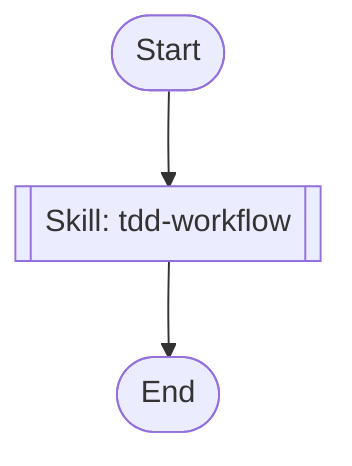

## Workflow Execution Guide

Follow the Mermaid flowchart above to execute the workflow. Each node type has specific execution methods as described below.

### Execution Methods by Node Type

- **Rectangle nodes (Sub-Agent: ...)**: Execute Sub-Agents
- **Diamond nodes (AskUserQuestion:...)**: Use the AskUserQuestion tool to prompt the user and branch based on their response
- **Diamond nodes (Branch/Switch:...)**: Automatically branch based on the results of previous processing (see details section)
- **Rectangle nodes (Prompt nodes)**: Execute the prompts described in the details section below

## Skill Nodes

#### sf_hs_skill(tdd-workflow)

- **Prompt**: skill "tdd-workflow" "Execute TDD (Red-Green-Refactor) cycle for Haskell backend implementation. Target services: svc-bff, svc-data-collector, svc-portfolio-planner, svc-risk-guard, svc-execution, svc-audit-log. Tech stack: GHC 9.12.2, Cabal, Servant, Warp, aeson, hspec + QuickCheck. Focus on API endpoints, business logic, domain types, and service layer."
