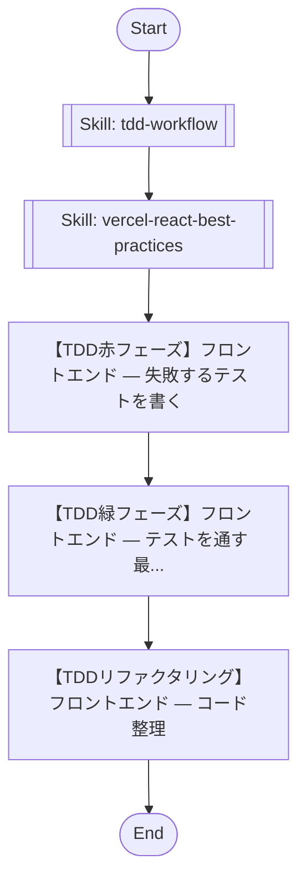

## Workflow Execution Guide

Follow the Mermaid flowchart above to execute the workflow. Each node type has specific execution methods as described below.

### Execution Methods by Node Type

- **Rectangle nodes**: Execute Sub-Agents using the Task tool
- **Diamond nodes (AskUserQuestion:...)**: Use the AskUserQuestion tool to prompt the user and branch based on their response
- **Diamond nodes (Branch/Switch:...)**: Automatically branch based on the results of previous processing (see details section)
- **Rectangle nodes (Prompt nodes)**: Execute the prompts described in the details section below

## Skill Nodes

#### fe_sf_tdd_skill(tdd-workflow)

- **Prompt**: skill "tdd-workflow" load-skill-knowledge-into-context-only

#### fe_sf_react_skill(vercel-react-best-practices)

- **Prompt**: skill "vercel-react-best-practices" load-skill-knowledge-into-context-only

### Prompt Node Details

#### fe_sf_red(【TDD赤フェーズ】フロントエンド — 失敗するテストを書く)

```
【TDD赤フェーズ】フロントエンド — 失敗するテストを書く
```

#### fe_sf_green(【TDD緑フェーズ】フロントエンド — テストを通す最...)

```
【TDD緑フェーズ】フロントエンド — テストを通す最小限の実装
```

#### fe_sf_refactor(【TDDリファクタリング】フロントエンド — コード整理)

```
【TDDリファクタリング】フロントエンド — コード整理
```
