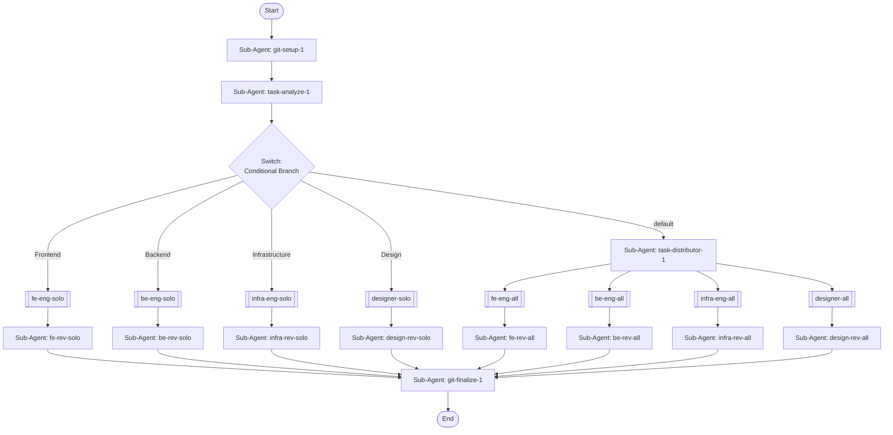

## Workflow Execution Guide

Follow the Mermaid flowchart above to execute the workflow. Each node type has specific execution methods as described below.

### Execution Methods by Node Type

- **Rectangle nodes (Sub-Agent: ...)**: Execute Sub-Agents
- **Diamond nodes (AskUserQuestion:...)**: Use the AskUserQuestion tool to prompt the user and branch based on their response
- **Diamond nodes (Branch/Switch:...)**: Automatically branch based on the results of previous processing (see details section)
- **Rectangle nodes (Prompt nodes)**: Execute the prompts described in the details section below

## Sub-Agent Node Details

#### git_setup_1(Sub-Agent: git-setup-1)

**Description**: Create feature branch, empty commit, draft PR

**Model**: sonnet

**Prompt**:

```
Create a new feature branch from the current branch, make an empty initial commit, and create a draft pull request. Use conventional branch naming based on the task description.
```

#### task_analyze_1(Sub-Agent: task-analyze-1)

**Description**: Understand requirements and decompose into domain tasks

**Model**: opus

**Prompt**:

```
Phase 1 - Task Understanding: Read and analyze all relevant project documentation to understand the requirements, architecture, and constraints. Review CLAUDE.md, design documents, and any referenced specification files to build comprehensive context for the task.

Phase 2 - Task Decomposition: Decompose the task into subtasks and determine which domains (Frontend, Backend, Infrastructure, Design) need work. If only one domain is affected, route to that domain's solo branch. If multiple domains are affected, route to the default branch for parallel execution across all domains.
```

#### fe_rev_solo(Sub-Agent: fe-rev-solo)

**Description**: Review and fix frontend code (solo)

**Model**: opus

**Prompt**:

```
Review the frontend code changes for quality, correctness, and adherence to project conventions. Fix any issues found during review.
```

#### be_rev_solo(Sub-Agent: be-rev-solo)

**Description**: Review and fix backend code (solo)

**Model**: opus

**Prompt**:

```
Review the backend code changes for quality, correctness, and adherence to project conventions. Fix any issues found during review.
```

#### infra_rev_solo(Sub-Agent: infra-rev-solo)

**Description**: Review and fix infrastructure code (solo)

**Model**: opus

**Prompt**:

```
Review the infrastructure code changes for quality, correctness, and adherence to project conventions. Fix any issues found during review.
```

#### design_rev_solo(Sub-Agent: design-rev-solo)

**Description**: Review and fix design compliance (solo)

**Model**: opus

**Prompt**:

```
Review the design changes for quality, correctness, and adherence to the design system. Fix any issues found during review.
```

#### task_distributor_1(Sub-Agent: task-distributor-1)

**Description**: Distribute tasks to all domain engineers

**Model**: sonnet

**Prompt**:

```
Distribute the decomposed tasks to all domain engineers (Frontend, Backend, Infrastructure, Design) for parallel execution.
```

#### fe_rev_all(Sub-Agent: fe-rev-all)

**Description**: Review and fix frontend (all domains)

**Model**: opus

**Prompt**:

```
Review the frontend code changes for quality, correctness, and adherence to project conventions. Fix any issues found during review.
```

#### be_rev_all(Sub-Agent: be-rev-all)

**Description**: Review and fix backend (all domains)

**Model**: opus

**Prompt**:

```
Review the backend code changes for quality, correctness, and adherence to project conventions. Fix any issues found during review.
```

#### infra_rev_all(Sub-Agent: infra-rev-all)

**Description**: Review and fix infrastructure (all domains)

**Model**: opus

**Prompt**:

```
Review the infrastructure code changes for quality, correctness, and adherence to project conventions. Fix any issues found during review.
```

#### design_rev_all(Sub-Agent: design-rev-all)

**Description**: Review and fix design (all domains)

**Model**: opus

**Prompt**:

```
Review the design changes for quality, correctness, and adherence to the design system. Fix any issues found during review.
```

#### git_finalize_1(Sub-Agent: git-finalize-1)

**Description**: Commit all changes and push to remote

**Model**: sonnet

**Prompt**:

```
Commit all changes with a conventional commit message and push to the remote repository. Update the draft pull request to ready for review.
```

## Sub-Agent Flow Nodes

#### fe_eng_solo(TDD-Frontend)

@Sub-Agent: dev_tdd-frontend

#### be_eng_solo(TDD-Backend)

@Sub-Agent: dev_tdd-backend

#### infra_eng_solo(TDD-Infrastructure)

@Sub-Agent: dev_tdd-infrastructure

#### designer_solo(TDD-Design)

@Sub-Agent: dev_tdd-design

#### fe_eng_all(TDD-Frontend)

@Sub-Agent: dev_tdd-frontend

#### be_eng_all(TDD-Backend)

@Sub-Agent: dev_tdd-backend

#### infra_eng_all(TDD-Infrastructure)

@Sub-Agent: dev_tdd-infrastructure

#### designer_all(TDD-Design)

@Sub-Agent: dev_tdd-design

### Switch Node Details

#### domain_switch_1(Multiple Branch (2-N))

**Evaluation Target**: Task decomposition routing result: which domains need work

**Branch conditions:**
- **Frontend**: Only frontend changes needed
- **Backend**: Only backend changes needed
- **Infrastructure**: Only infrastructure changes needed
- **Design**: Only design changes needed
- **default**: Other cases

**Execution method**: Evaluate the results of the previous processing and automatically select the appropriate branch based on the conditions above.
