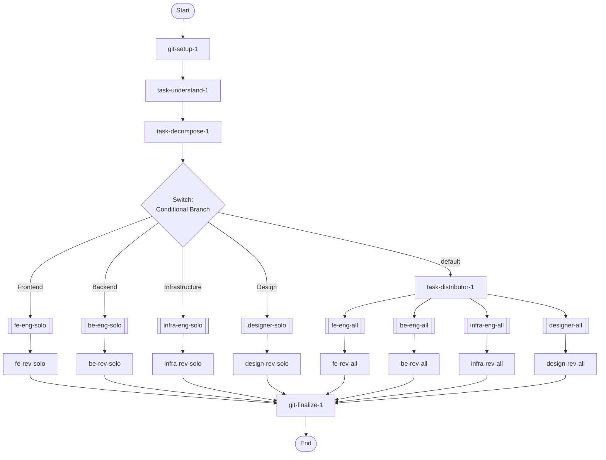

## Workflow Execution Guide

Follow the Mermaid flowchart above to execute the workflow. Each node type has specific execution methods as described below.

### Execution Methods by Node Type

- **Rectangle nodes**: Execute Sub-Agents using the Task tool
- **Diamond nodes (AskUserQuestion:...)**: Use the AskUserQuestion tool to prompt the user and branch based on their response
- **Diamond nodes (Branch/Switch:...)**: Automatically branch based on the results of previous processing (see details section)
- **Rectangle nodes (Prompt nodes)**: Execute the prompts described in the details section below

## Sub-Agent Flow Nodes

#### fe_eng_solo(TDD-Frontend-Solo)

@Sub-Agent: dev_tdd-frontend

#### be_eng_solo(TDD-Backend-Solo)

@Sub-Agent: dev_tdd-backend

#### infra_eng_solo(TDD-Infra-Solo)

@Sub-Agent: dev_tdd-infrastructure

#### designer_solo(TDD-Design-Solo)

@Sub-Agent: dev_tdd-design

#### fe_eng_all(TDD-Frontend-All)

@Sub-Agent: dev_tdd-frontend

#### be_eng_all(TDD-Backend-All)

@Sub-Agent: dev_tdd-backend

#### infra_eng_all(TDD-Infra-All)

@Sub-Agent: dev_tdd-infrastructure

#### designer_all(TDD-Design-All)

@Sub-Agent: dev_tdd-design

### Switch Node Details

#### domain_switch_1(Multiple Branch (2-N))

**Evaluation Target**: Task decomposition routing result: which domains need work

**Branch conditions:**
- **Frontend**: Only frontend changes needed
- **Backend**: Only backend changes needed
- **Infrastructure**: Only infrastructure changes needed
- **Design**: Only design changes needed
- **default**: Other cases

**Execution method**: Evaluate the results of the previous processing and automatically select the appropriate branch based on the conditions above.
