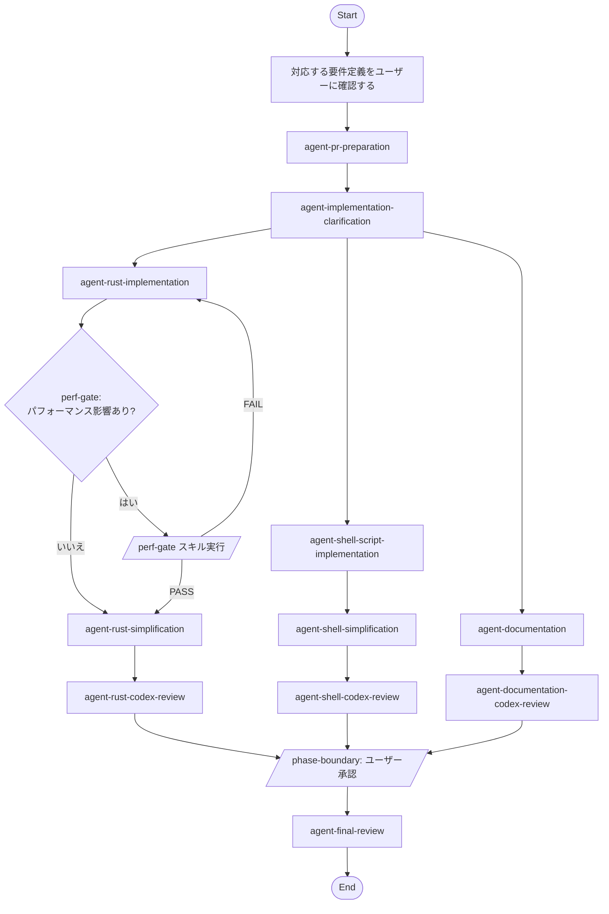

## Workflow Execution Guide

Follow the Mermaid flowchart above to execute the workflow. Each node type has specific execution methods as described below.

### Execution Methods by Node Type

- **Rectangle nodes**: Execute Sub-Agents using the Task tool
- **Diamond nodes (AskUserQuestion:...)**: Use the AskUserQuestion tool to prompt the user and branch based on their response
- **Diamond nodes (Branch/Switch:...)**: Automatically branch based on the results of previous processing (see details section)
- **Rectangle nodes (Prompt nodes)**: Execute the prompts described in the details section below

### Prompt Node Details

#### prompt_input_requirement(対応する要件定義をユーザーに確認する)

```
対応する要件定義をユーザーに確認する
```

### Skill Node Details

#### perf_gate_check(パフォーマンス影響あり?)

要件定義の内容から、パフォーマンスに影響する変更かどうかを判定する。以下の場合は「はい」:
- パフォーマンス最適化タスク
- データ構造の変更
- アルゴリズムの変更
- ホットパス上のコード変更

#### perf_gate_run(/perf-gate スキル実行)

`/perf-gate` スキルのワークフローに従ってベンチマーク比較を実行する。
- **PASS**: agent_rust_simplification に進む
- **FAIL**: agent_rust_implementation に戻り、リグレッションを修正

#### phase_boundary_confirm(/phase-boundary: ユーザー承認)

全実装フロー（Rust/Shell/ドキュメント）の完了後、最終レビュー前にユーザーに承認を求める:
```
実装フェーズ完了:
- Rust: [完了/スキップ]
- Shell: [完了/スキップ]
- ドキュメント: [完了/スキップ]

最終レビューフェーズを開始してよいですか？
```
