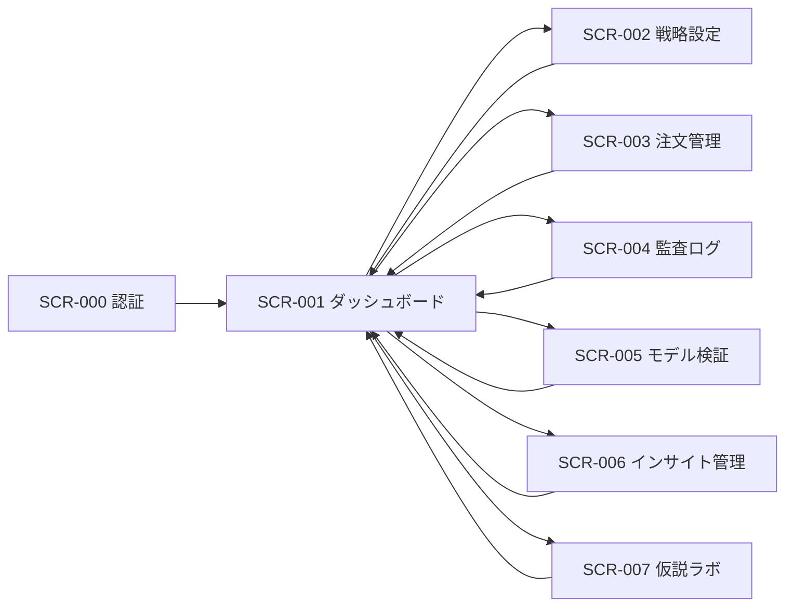

# 画面外部設計（共通）

最終更新日: 2026-02-24

## 1. 文書情報

| 項目 | 内容 |
|---|---|
| 作成者 | Codex |
| レビュー担当 | TBD |
| 承認者 | TBD |
| 参照要件 | `機能仕様書.md`, `investment-ai-requirements.md` |
| 関連設計 | `外部設計/services/*.md` |

## 2. 目的と適用範囲

### 2.1 目的

- 画面共通の外部仕様（遷移、UI状態、アクセシビリティ、監査）を定義する。

### 2.2 適用範囲

- 対象ロール: 運用者（単一ユーザー）
- 対象デバイス: PC優先（レスポンシブでモバイル対応）
- 対応ブラウザ: 最新版 Chrome / Safari / Edge

## 3. 用語・前提

| 用語 | 定義 |
|---|---|
| kill switch | 緊急停止状態。発注系操作を禁止する。 |
| trace | 画面操作とバックエンドイベントを紐づける相関ID。 |
| approved model | 検証基準を満たし本番利用が許可されたモデル。 |

## 4. 画面一覧

| 画面ID | 画面名 | URL | 主目的 | 利用ロール |
|---|---|---|---|---|
| SCR-000 | 認証 | `/login` | 運用者の本人確認 | 運用者 |
| SCR-001 | ダッシュボード | `/dashboard` | 運用状態の把握と緊急操作 | 運用者 |
| SCR-002 | 戦略設定 | `/settings/strategy` | 運用パラメータ設定 | 運用者 |
| SCR-003 | 注文管理 | `/orders` | 注文候補の確認・承認・再送 | 運用者 |
| SCR-004 | 監査ログ | `/audit` | 監査追跡・障害調査 | 運用者 |
| SCR-005 | モデル検証 | `/models/validation` | モデル評価結果確認と昇格判断 | 運用者 |
| SCR-006 | インサイト管理 | `/insights` | 定性インサイト確認と仮説化 | 運用者 |
| SCR-007 | 仮説ラボ | `/hypotheses` | 仮説検証と採否判断 | 運用者 |

## 5. 画面遷移設計

### 5.1 遷移ルール

- 未認証時は常に `SCR-000` へ遷移する。
- kill switch 有効時は、発注系操作を含むボタンを無効化する。
- API障害時は画面遷移せず、同画面で再試行導線を表示する。

### 5.2 画面遷移図

### 5.3 遷移定義

| From | To | トリガー | 条件 | 失敗時挙動 |
|---|---|---|---|---|
| SCR-000 | SCR-001 | ログイン成功 | 認証成功 | 認証エラー表示 |
| SCR-001 | SCR-002 | 設定メニュー選択 | 認証済み | トースト表示 |
| SCR-001 | SCR-003 | 注文管理メニュー選択 | 認証済み | トースト表示 |
| SCR-001 | SCR-004 | 監査ログメニュー選択 | 認証済み | トースト表示 |
| SCR-001 | SCR-005 | モデル検証メニュー選択 | 認証済み | トースト表示 |
| SCR-001 | SCR-006 | インサイトメニュー選択 | 認証済み | トースト表示 |
| SCR-001 | SCR-007 | 仮説ラボメニュー選択 | 認証済み | トースト表示 |

## 6. 共通UI仕様

### 6.1 レイアウト

- ヘッダー: 固定（アプリ名、現在時刻、ユーザーメニュー）
- ナビゲーション: 左サイド固定（主要5画面）
- メイン: 画面固有コンテンツ

### 6.2 共通コンポーネント

| コンポーネント | 用途 | 表示ルール | 備考 |
|---|---|---|---|
| グローバルトースト | 成功/警告/失敗通知 | 操作完了後に右上表示 | 5秒後に自動消去 |
| 確認モーダル | 破壊的操作前確認 | 承認・却下・kill switch変更前 | フォーカストラップ必須 |
| 再試行バナー | API障害通知 | `error` 状態で表示 | 再試行ボタンを表示 |

### 6.3 共通状態

- `initial`: 初期表示
- `loading`: 通信中
- `empty`: 一覧対象なし
- `error`: API失敗またはデータ不整合
- `disabled`: 権限不足またはkill switch有効

## 7. 共通バリデーション方針

- 入力エラーは「項目下の個別表示」と「画面上部の要約表示」を併用する。
- 数値入力は最小値・最大値・桁数を明示する。
- 保存系操作は、無効値のまま送信できない。

## 8. 共通監査・ログ要件

- 更新系操作は必ず監査ログを生成する。
- 必須項目: `timestamp`, `userId`, `trace`, `screenId`, `actionId`, `result`, `reason`
- 画面で表示する `trace` はコピー可能とする。

## 9. 共通アクセシビリティ要件

- キーボードのみで全操作可能。
- フォーカス可視化を提供。
- コントラスト比はWCAG 2.2 AA準拠。
- エラーは色だけに依存せずテキストで通知。

## 10. 共通非機能要件

| 項目 | 目標値 | 備考 |
|---|---|---|
| 初期表示 | p95 2.0秒以内 | 通常ネットワーク条件 |
| 画面操作応答 | p95 1.0秒以内 | 一覧フィルタ操作 |
| 可用性 | 99.5%/月 | MVP暫定 |

## 11. スコープ外

- 画面内部コンポーネント実装の詳細。
- CSS実装詳細。
- API内部処理ロジック。
