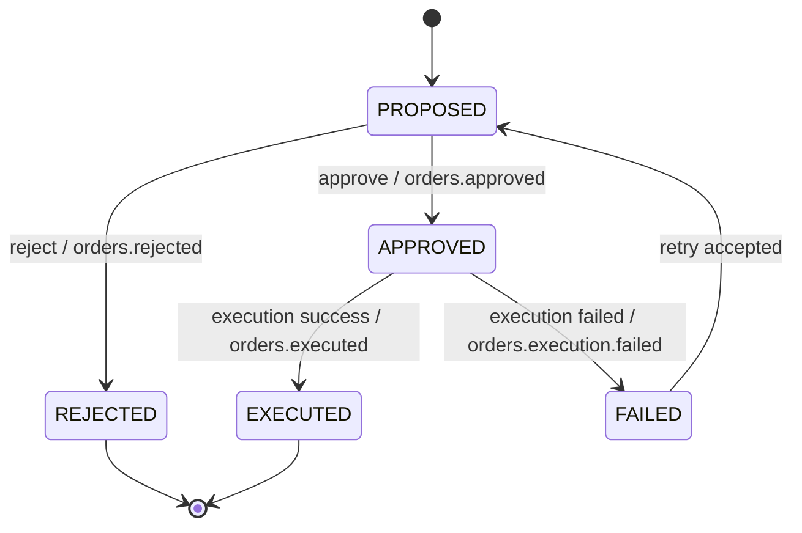
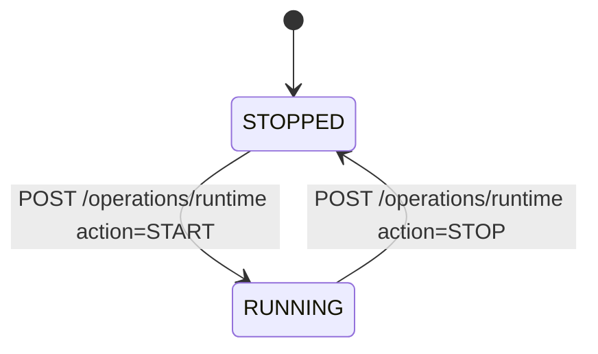
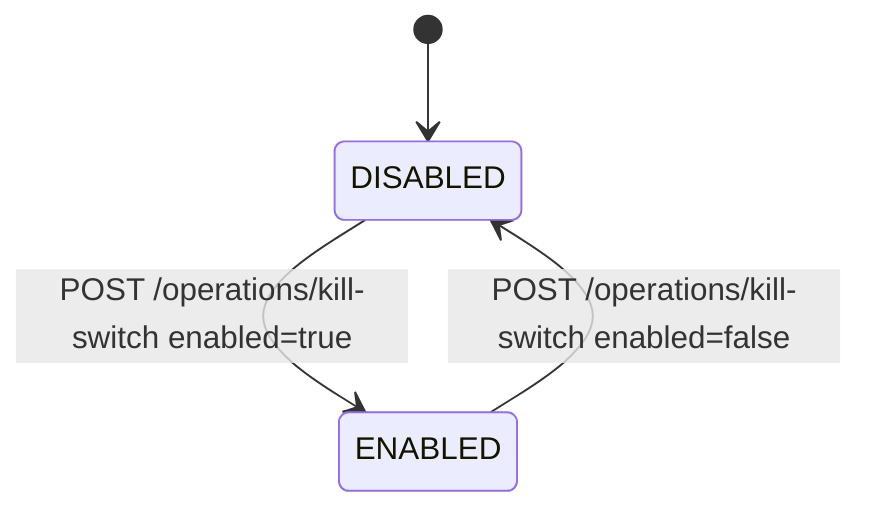
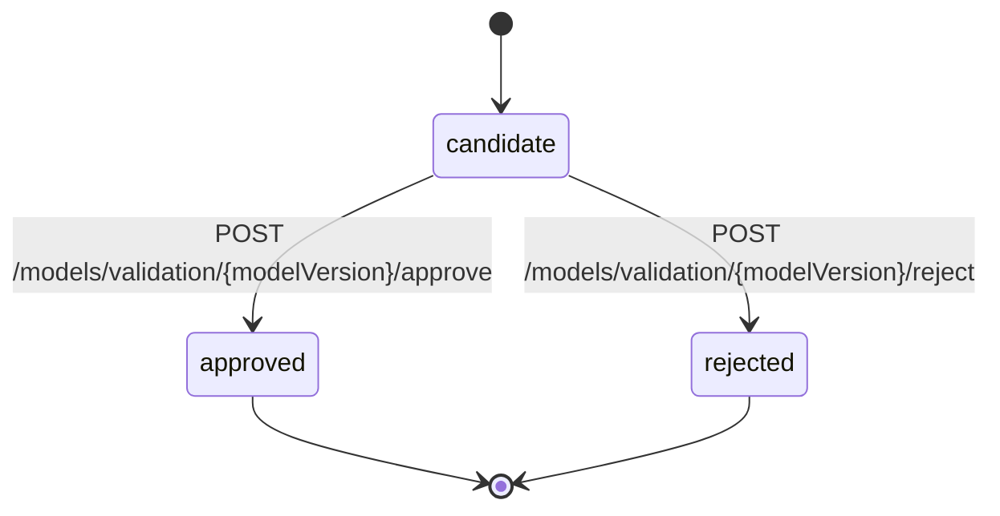
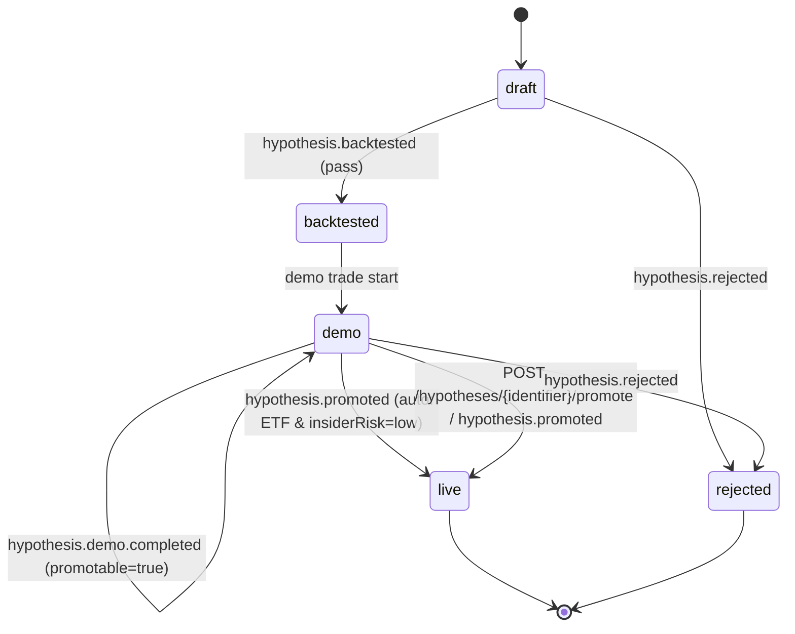

# 状態遷移設計

最終更新日: 2026-02-28

## 1. 目的

- イベント駆動アーキテクチャにおける状態遷移を明文化し、実装・テスト・運用判断を統一する。
- 対象は `orders`、`operations`（runtime / kill switch）、`model status`。

## 2. 共通ルール

1. すべての状態遷移は監査対象とし、`trace` を記録する。  
2. 冪等性キー（`identifier`）で重複遷移を防止する。  
3. 無効遷移は状態を変更せず、`409 Conflict` または `*.failed` イベントで返す。  
4. 状態更新とイベント発行の順序は、更新成功後に発行する。  

## 3. Orders 状態遷移

### 3.1 状態一覧

- `PROPOSED`: 注文候補作成済み
- `APPROVED`: リスク審査承認済み
- `REJECTED`: リスク審査却下済み（終端）
- `EXECUTED`: 執行成功（終端）
- `FAILED`: 執行失敗

### 3.2 遷移図

### 3.3 遷移表

| 現在状態 | トリガー | 条件 | 次状態 | 担当 |
|---|---|---|---|---|
| `PROPOSED` | `POST /orders/{identifier}/approve`（BFF受付→`POST /internal/orders/{identifier}/approve` 委譲）/ `orders.approved` | kill switch無効 + リスク制約OK | `APPROVED` | `risk-guard` |
| `PROPOSED` | `POST /orders/{identifier}/reject`（BFF受付→`POST /internal/orders/{identifier}/reject` 委譲）/ `orders.rejected` | 却下理由あり | `REJECTED` | `risk-guard` |
| `APPROVED` | `orders.executed` | ブローカー発注成功 | `EXECUTED` | `execution` |
| `APPROVED` | `orders.execution.failed` | 再試行上限到達または恒久エラー | `FAILED` | `execution` |
| `FAILED` | `POST /orders/{identifier}/retry` | 再送可能条件を満たす | `PROPOSED` | `bff` |

### 3.4 禁止遷移

- `EXECUTED -> *`（変更不可）
- `REJECTED -> *`（変更不可）
- `PROPOSED -> EXECUTED`（審査未通過）

## 4. Operations 状態遷移

`runtime` と `kill switch` は独立状態として管理する。

### 4.1 Runtime 状態

- `STOPPED`
- `RUNNING`

| 現在状態 | トリガー | 次状態 | 備考 |
|---|---|---|---|
| `STOPPED` | `START` | `RUNNING` | 既に実行中ジョブがないこと |
| `RUNNING` | `STOP` | `STOPPED` | 実行中ジョブは安全停止ポリシーに従う |

### 4.2 Kill Switch 状態

- `DISABLED`
- `ENABLED`

| 現在状態 | トリガー | 次状態 | 効果 |
|---|---|---|---|
| `DISABLED` | `enabled=true` | `ENABLED` | 承認/執行系操作を停止 |
| `ENABLED` | `enabled=false` | `DISABLED` | 承認/執行系操作を再開可能 |

## 5. Model Status 状態遷移

### 5.1 状態一覧

- `candidate`: 評価対象
- `approved`: 本番利用可（終端）
- `rejected`: 差し戻し（終端）

### 5.2 遷移図

### 5.3 遷移表

| 現在状態 | トリガー | 条件 | 次状態 |
|---|---|---|---|
| `candidate` | `approve` | コメント必須 + 検証指標確認済み | `approved` |
| `candidate` | `reject` | コメント必須 | `rejected` |

### 5.4 補足ルール

- モデル状態は「モデルバージョン単位」で不変とする（`approved/rejected` 後の再遷移なし）。
- 実際に推論で利用する「アクティブモデル」は別ポインタで管理し、別版を `approved` にすることで切替える。

## 6. Hypothesis Status 状態遷移

### 6.1 状態一覧

- `draft`: 仮説生成直後
- `backtested`: バックテスト完了
- `demo`: デモトレード中
- `live`: 本番利用中（終端）
- `rejected`: 却下（終端）

### 6.2 遷移図

### 6.3 補足ルール

- `demo` は最低1か月（推奨1〜2か月）継続する。
- `requiresComplianceReview=true` の仮説は `live` へ遷移不可。
- 無条件の自動昇格は禁止する。
- 自動昇格は `instrumentType=ETF` かつ `insiderRisk=low` かつ `mnpiSelfDeclared=true` かつ `partnerRestrictedSymbols` 非該当時のみ許可する。
- 個別株（`instrumentType=STOCK`）の `live` 遷移は運用者の `POST /hypotheses/{identifier}/promote` を必須とする。

## 7. API / Event 対応表

| ドメイン | APIトリガー | 発行イベント |
|---|---|---|
| Orders | `POST /orders/{identifier}/approve`（BFF受付→risk-guard内部コマンド） | `orders.approved` |
| Orders | `POST /orders/{identifier}/reject`（BFF受付→risk-guard内部コマンド） | `orders.rejected` |
| Orders | `POST /orders/{identifier}/retry` | `orders.proposed`（再送時） |
| Operations | `POST /operations/kill-switch` | `operation.kill_switch.changed` |
| Commands | `POST /commands/run-cycle` | `market.collect.requested` |
| Execution | - | `orders.executed`, `orders.execution.failed` |
| Insight | `POST /commands/run-insight-cycle` | `insight.collect.requested` |
| Hypothesis | `POST /hypotheses/{identifier}/retest` | `hypothesis.retest.requested` |
| Hypothesis | `PUT /hypotheses/{identifier}/mnpi-self-declaration` | - |
| Hypothesis | -（自動昇格条件充足） | `hypothesis.promoted` |
| Hypothesis | `POST /hypotheses/{identifier}/promote` | `hypothesis.promoted` |
| Hypothesis | `POST /hypotheses/{identifier}/reject` | `hypothesis.rejected` |

## 8. 参照

- OpenAPI: `外部設計/api/openapi.yaml`
- AsyncAPI: `外部設計/api/asyncapi.yaml`
- BFF外部設計: `外部設計/services/bff.md`
- Risk Guard外部設計: `外部設計/services/risk-guard.md`
- Execution外部設計: `外部設計/services/execution.md`
；
