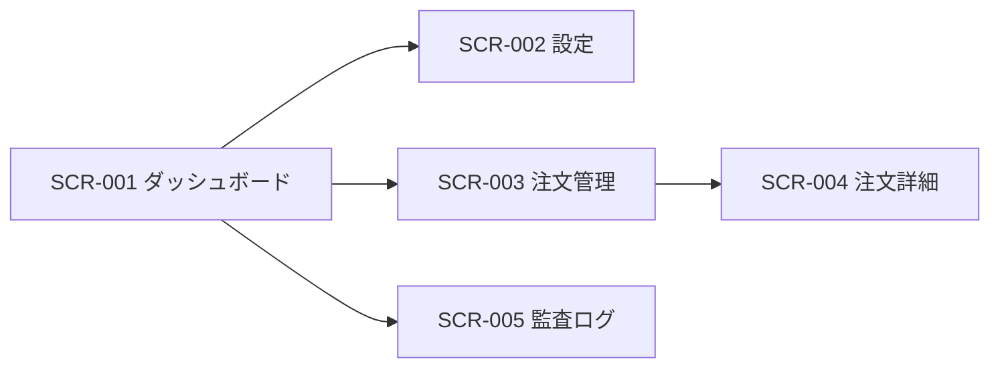

# 画面外部設計書テンプレート

最終更新日: YYYY-MM-DD  
文書バージョン: v0.1  
対象システム: [システム名]

## 1. 文書情報

| 項目 | 内容 |
|---|---|
| 作成者 |  |
| レビュー担当 |  |
| 承認者 |  |
| 参照要件 | 例: `investment-ai-requirements.md`, `機能仕様書.md` |
| 関連設計 | 例: `外部設計/services/*.md` |

## 2. 目的と適用範囲

### 2.1 目的

- 本書は画面の外部仕様（利用者から見える振る舞い）を定義する。
- 内部実装（クラス設計、アルゴリズム詳細）は対象外とする。

### 2.2 適用範囲

- 対象ロール: [運用者/管理者/一般ユーザー]
- 対象デバイス: [PC/タブレット/モバイル]
- 対応ブラウザ: [Chrome/Safari/Edge など]

## 3. 用語・前提

| 用語 | 定義 |
|---|---|
| kill switch | 緊急停止状態。発注系操作を禁止する。 |
| trace | 操作とイベントを横断追跡するID。 |
| [任意追加] |  |

## 4. 画面一覧

| 画面ID | 画面名 | URL | 主目的 | 利用ロール |
|---|---|---|---|---|
| SCR-001 |  |  |  |  |
| SCR-002 |  |  |  |  |

## 5. 画面遷移設計

### 5.1 遷移ルール

- 認証未完了時はログイン画面へ遷移する。
- 権限不足時はアクセス拒否画面またはトップへ遷移する。
- 致命的エラー時は再試行導線を表示する。

### 5.2 画面遷移図（mermaid）

### 5.3 遷移定義

| From | To | トリガー | 条件 | 失敗時挙動 |
|---|---|---|---|---|
| SCR-001 | SCR-002 | 設定ボタン押下 | 権限あり | エラー通知 |
|  |  |  |  |  |

## 6. 共通UI仕様

### 6.1 レイアウト

- ヘッダー: [固定/スクロール]
- ナビゲーション: [サイド/トップ]
- フッター: [有無]

### 6.2 共通コンポーネント

| コンポーネント | 用途 | 表示ルール | 備考 |
|---|---|---|---|
| トースト通知 | 完了/警告/失敗通知 | 操作後に表示 | 自動消去秒数を定義 |
| モーダル | 確認・注意喚起 | 破壊的操作前に表示 | フォーカストラップ必須 |

### 6.3 共通状態

- `initial`: 初期表示
- `loading`: 通信中
- `empty`: データなし
- `error`: 取得失敗
- `disabled`: 操作不可（権限不足/kill switch等）

## 7. 画面詳細（画面ごとに記載）

以下ブロックを画面数分コピーして記載する。

---

## 7.x [画面ID] [画面名]

### 7.x.1 画面概要

- 目的:  
- 利用ロール:  
- URL:  
- 表示条件:  

### 7.x.2 レイアウト構成

| 領域ID | 領域名 | 内容 | 表示条件 |
|---|---|---|---|
| R-01 | ヘッダー |  | 常時 |
| R-02 | メイン |  |  |

### 7.x.3 表示項目定義

| 項目ID | 項目名 | 型 | フォーマット | データソース | 表示ルール |
|---|---|---|---|---|---|
| F-001 |  | string |  |  |  |
| F-002 |  | number | 例: `#,##0.00` |  |  |

### 7.x.4 操作定義

| 操作ID | 操作名 | トリガー | 事前条件 | 成功時 | 失敗時 |
|---|---|---|---|---|---|
| A-001 |  | ボタン押下 |  |  |  |
| A-002 |  |  |  |  |  |

### 7.x.5 バリデーション

| 対象項目 | ルール | エラーメッセージ | 表示位置 |
|---|---|---|---|
|  | 必須 |  | 項目下 |
|  | 形式 |  | エラー要約 + 項目下 |

### 7.x.6 画面状態別表示

| 状態 | 表示内容 | 操作可否 |
|---|---|---|
| initial |  |  |
| loading | スケルトン/スピナー | 主要操作不可 |
| empty | 空状態メッセージ | 再読込可 |
| error | エラー詳細 + 再試行 | 再試行可 |
| disabled | 理由表示 | 操作不可 |

### 7.x.7 メッセージ定義

| 種別 | メッセージID | 文言 | 発生条件 |
|---|---|---|---|
| info | MSG-I-001 |  |  |
| warning | MSG-W-001 |  |  |
| error | MSG-E-001 |  |  |

### 7.x.8 監査・ログ要件

- 記録する操作: [作成/更新/削除/承認/却下]
- 必須項目: `timestamp`, `userId`, `trace`, `screenId`, `actionId`, `result`

### 7.x.9 アクセシビリティ要件

- キーボード操作可能
- 可視フォーカスあり
- エラーメッセージはテキストで明示
- モーダルはフォーカストラップ

---

## 8. ユースケース定義（画面観点）

| UC ID | 名称 | 主体 | 事前条件 | トリガー | 基本フロー | 代替フロー | 事後条件 |
|---|---|---|---|---|---|---|---|
| UC-UI-001 |  |  |  |  |  |  |  |
| UC-UI-002 |  |  |  |  |  |  |  |

## 9. 非機能要件（画面）

### 9.1 性能

| 項目 | 目標値 | 備考 |
|---|---|---|
| 初期表示 | 例: p95 2.0秒以内 | 計測条件を定義 |
| 操作応答 | 例: p95 1.0秒以内 | 更新系API除く |

### 9.2 可用性

- 目標稼働率: [例: 99.5%/月]
- 障害時方針: [リトライ、フォールバック、問い合わせ導線]

### 9.3 セキュリティ

- 認証: [OIDC/JWTなど]
- 認可: 画面単位・操作単位で定義
- 秘密情報: 画面に表示しない/マスクする

### 9.4 監査・保持

- 監査ログ保持期間: [例: 1年]
- 表示履歴の扱い: [必要に応じて定義]

## 10. スコープ外

- 内部アルゴリズム詳細
- DBスキーマの内部最適化
- バックエンド実装方式の詳細

## 11. 変更履歴

| 日付 | 版 | 変更内容 | 変更者 |
|---|---|---|---|
| YYYY-MM-DD | v0.1 | 初版作成 |  |

## 12. 参考

- 機能仕様書: `機能仕様書.md`
- 外部設計書作成ガイド: `外部設計/外部設計書_作成ガイド.md`
- 関連サービス設計: `外部設計/services/`

