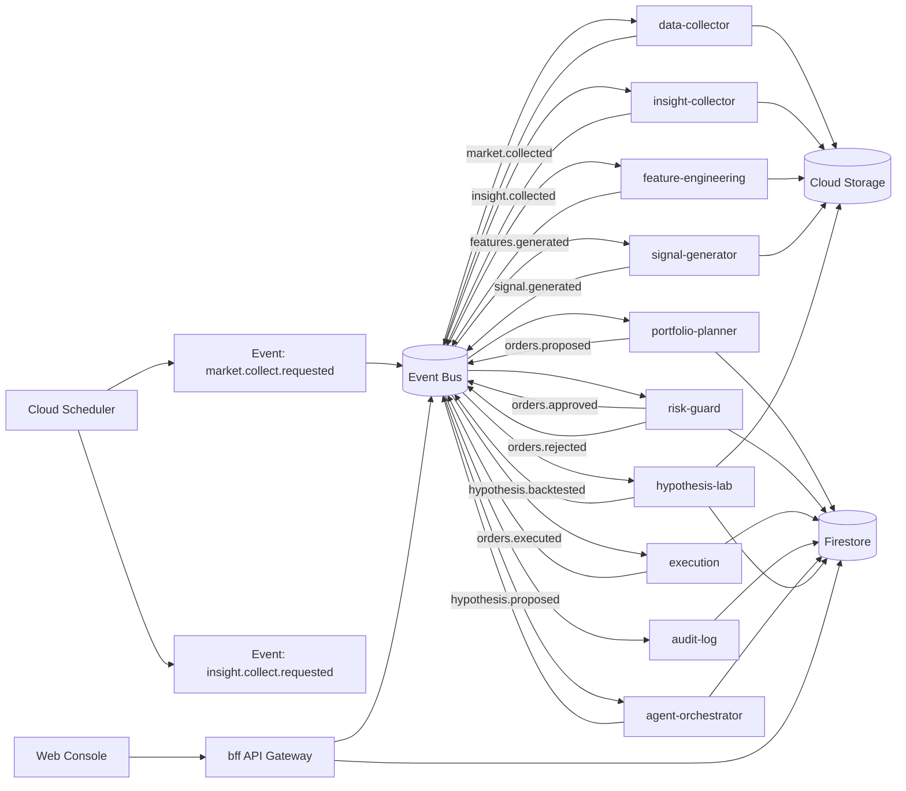

# 機能仕様書

最終更新日: 2026-02-28

## 背景目的

### 背景・課題

- 過去データ学習のみでは、長期での市場超過は安定しにくい。
- コスト（手数料、スリッページ）と過学習で実運用成績が劣化しやすい。
- 低コスト運用を優先しつつ、検証可能性と安全性を担保する必要がある。

### 目的・ゴール

- 想定ユーザー1名向けに、AI投資運用MVPを構築する。
- 売買対象は日本市場、シグナルは日本+米国情報を使用する。
- イベント駆動マイクロサービス構成で、疎結合かつ低運用コストを実現する。

## 設計概要

### 実装内容

- 市場データ収集、特徴量生成、シグナル生成、注文作成、リスク審査、執行、監査ログを分離したマイクロサービスを実装する。
- 定性分析用に、情報収集・要約・仮説化を担うエージェント系サービスを追加する。
- サービス間連携はイベントバス（Pub/Sub想定）で非同期実行する。
- フロントエンド連携は BFF（Backend for Frontend）を経由し、画面向けにAPIを集約する。
- 永続化は用途分離する。
- Firestore: 設定、ポジション、注文、監査ログ、運用状態
- Cloud Storage: 履歴データ、特徴量スナップショット、モデル成果物
- Firestore: Skill定義、仮説台帳、失敗知見DB、指示書プロファイルも管理する。
- Cloud Storage: 収集テキスト、字幕、論文要約、検証レポートを保存する。
- 定期起動はCloud Schedulerからイベント投入で実行する。

## スコープ

### ターゲット

- 個人運用者（単一ユーザー）
- MVPフェーズでは自分用運用に限定
- 初期対象資産は現物株（日本株）

## ユースケース

### 対象機能

1. 運用設定管理
- 銘柄ユニバース、売買頻度、上限ポジション、損失制限を管理する。

2. データ収集
- 日本・米国データを定期取得し、正規化して保存する。

3. 特徴量生成
- モデル入力用特徴量を生成し、バージョン付きで保存する。

4. シグナル生成
- 銘柄ごとの期待リターン/スコアを算出する。

5. 注文候補作成
- シグナルと保有状況からリバランス案を作成する。

6. リスクチェック
- 注文前に制約チェック（損失上限、集中度、売買上限、kill switch）を実施する。

7. 注文執行
- ブローカーAPIへ発注し、約定結果を保存する。

8. 監査・可観測性
- 全イベントに `trace` を付与し、判断根拠とモデル版を保存する。

9. 障害対応
- 失敗イベントの再実行、デッドレターキュー、通知を提供する。

10. 定性インサイト抽出
- X/YouTube/論文/GitHubを定時収集し、銘柄・テーマ・センチメントへ構造化する。

11. Skill資産化
- Claude Code Skillをバージョン管理し、取得・分析・検証フローを再利用可能にする。

12. 仮説ポートフォリオ運用
- 仮説を `draft -> backtested -> demo -> live/rejected` で管理する。
- 失敗仮説も削除せず再探索時の除外根拠として保持する。

### mermaidによる構成図

### 技術的制約と方針

- コスト最優先
- 常時稼働は最小化し、バッチ中心で実行する。
- Firestore無料枠を意識したクエリ設計を行う。

- イベント駆動原則
- すべてのサービスは冪等性を持つ。
- イベントスキーマを固定し、後方互換を維持する。

- データ品質
- 時点整合を厳守し、将来情報リークを禁止する。
- データ欠損時は執行停止または縮小運用へフェイルセーフする。

- 検証と安全性
- Walk-forward/OOSで評価したモデルのみ本番反映する。
- kill switch有効時は執行サービスが必ず注文を拒否する。

- AI探索運用
- AIは戦略案の探索と改善ループを担当し、最終判断は「手動」または「条件付き自動昇格ポリシー」で実行する。
- 評価ループは `戦略生成 -> バックテスト -> 結果フィードバック -> 改善` を自動化する。
- 評価関数に含まれない項目（取引コスト、スリッページ、約定制約）は明示的に組み込む。
- 単一モデル出力に依存せず、複数視点で候補比較できる運用を許容する。
- 定性系は一次ソースURL・取得時刻・抽出根拠を必須保存し、根拠不明の要約を禁止する。
- Markdown指示書をプロトコル化し、AIの分析スタイルを固定する。
- 頻出計算（PBR等）は事前計算し、トークン消費と計算揺れを削減する。

- コンプライアンス
- AI提案戦略の注文ロジックは、不公正取引リスク観点で人手レビューを必須化する。
- コンプライアンス懸念が解消されるまで、当該戦略は昇格不可とする。
- デモトレード（1〜2か月）を通過しない戦略は本番昇格不可とする。
- 自動昇格は `instrumentType=ETF` かつ `insiderRisk=low` の場合のみ許可する。
- 個別株の昇格は常に手動承認を必須とする。
- 昇格時は `MNPIを知らない` 自己申告、`reasonCode`、`trace` を監査ログに必須記録する。
- 取引先・案件関連銘柄（`partnerRestrictedSymbols`）は自動昇格対象から除外する。

- 規約順守
- データ利用規約（J-Quants等）に従い、用途制限を越える機能はMVP対象外とする。

## 技術選定詳細（研究結果ベース）

### 技術選定の判断基準

- 研究上の主要リスクである「コスト侵食」「過学習」「シグナル劣化」「レジーム変化」に対応できることを採用条件とする。
- 単一ユーザーMVPのため、固定費より従量課金を優先し、不要な常時稼働を避ける。
- 監査可能性（再現性、追跡性、説明可能性）を必須とする。

### 採用技術と比較

| 領域 | 採用技術 | 比較対象 | 採用理由 | 比較上の優位性 | 制約/注意点 | 公式ドキュメント |
|---|---|---|---|---|---|---|
| イベントバス | Google Cloud Pub/Sub | Kafka, RabbitMQ | イベント駆動マイクロサービスの中核。運用管理を最小化し、再送・DLQを構成しやすい。 | Kafka/RabbitMQより自己運用コストが低い。単一ユーザーMVPで過剰なクラスタ運用が不要。 | 厳密順序やExactly-once要件は設計で補う。 | https://cloud.google.com/pubsub/docs/overview |
| 実行基盤 | Cloud Run | GKE, Cloud Functions | API/バッチを同一基盤で実行。`min instances=0` でアイドル費を抑える。 | GKEより運用負荷が低く、Cloud Functionsよりコンテナ自由度が高い。 | 長時間処理はジョブ分割が必要。 | https://cloud.google.com/run/docs/overview |
| 定期実行 | Cloud Scheduler + Pub/Sub | Cloud Composer(Airflow), cron VM | 定時イベント投入のみを担当し、オーケストレーションを簡素化。 | Composerより低コスト。VM常駐不要。 | 複雑依存はWorkflows追加を検討。 | https://cloud.google.com/scheduler/docs/overview |
| トランザクションDB | Firestore | Supabase(PostgreSQL), Cloud SQL | 単一ユーザーでは無料枠が効きやすく、固定費を抑えられる。 | Supabase Pro固定費やCloud SQL常時起動費を回避。 | クエリ設計次第でRead課金増。Listener多用に注意。 | https://cloud.google.com/firestore/docs |
| データレイク | Cloud Storage + Parquet | BigQuery一本化, Firestore保存 | 履歴時系列と特徴量を低単価保管し、学習再現性を確保。 | Firestoreより大容量保存コストが低い。BigQuery常用より安価に保持可能。 | クエリ機能は弱い。集計時のみBQ連携を検討。 | https://cloud.google.com/storage/docs |
| 学習/推論 | Python + scikit-learn + LightGBM | PyTorch中心の深層学習 | 少量データ・表形式特徴量のMVPで高コスパ。学習と推論の実装が簡潔。 | 深層学習より学習コストと運用コストを抑制。説明性が高い。 | 非線形時系列の複雑表現は限界。拡張時にPyTorch追加。 | https://scikit-learn.org/stable/ , https://lightgbm.readthedocs.io/ |
| 実験管理 | MLflow | Vertex AI Experiments, 手作業管理 | モデル版、特徴量版、評価結果を追跡し再現性を担保。 | 手作業管理より監査性が高い。Vertex AIより初期費用を抑えやすい。 | サーバ管理が必要。MVPでは最小構成で運用。 | https://mlflow.org/docs/latest/index.html |
| 検証基盤 | Walk-forward + DSR/PBO + コスト込みBT | 単純Holdout, コスト無視BT | 研究で指摘された過学習・見せかけ優位を抑制する。 | Holdout単体より実運用への外挿性が高い。 | 実装が複雑。評価ジョブを標準化する。 | https://carmamaths.org/resources/jon/backtest.pdf |
| 観測/監査 | Cloud Logging + Error Reporting + trace | ローカルログのみ | 障害復旧と意思決定の追跡を実現。 | ローカルログより検索性・運用性が高い。 | ログ量増でコスト増。保持期間を制御。 | https://cloud.google.com/logging/docs , https://cloud.google.com/error-reporting/docs |
| シークレット管理 | Secret Manager | `.env`直置き | APIキー漏洩リスクを低減し、ローテーション可能にする。 | `.env`より安全。監査しやすい。 | 参照権限のIAM設計が必須。 | https://cloud.google.com/secret-manager/docs |
| 定性エージェント実行 | Claude Code Skill + Cloud Run Job | 手作業リサーチ | 収集・抽出・検証を再利用可能なコード資産にできる。 | 作業者依存を下げ、検証再現性を高める。 | Skill品質評価と権限管理が必要。 | 社内Skill設計書（本ドキュメント群） |

### 研究結果と技術選定の対応表

| 研究で示された課題 | 設計上の対策 | 対応技術 |
|---|---|---|
| 手数料・売買コストで超過収益が消える | 低回転運用、執行前リスクチェック、コスト込み評価 | `portfolio-planner`, `risk-guard`, 検証基盤 |
| 多重検定・過学習 | Walk-forward、DSR/PBO、モデル昇格ゲート | MLflow、検証ジョブ、監査ログ |
| 公表後劣化・シグナル減衰 | 定期再学習、ドリフト監視、モデル差し戻し | `signal-generator`, 監視/通知 |
| レジーム変化 | 特徴量再計算、運用パラメータ切替、kill switch | `feature-engineering`, 設定管理、`risk-guard` |

### MVPで採用しない技術（現時点）

- Kafka常設クラスター
- 理由: 単一ユーザーMVPでは運用負荷が高くコスト効率が低い。

- GKE常時稼働
- 理由: Cloud Runで十分。クラスター管理が過剰。

- 深層学習ファースト（Transformer等）
- 理由: 学習/推論コスト増に対し、初期優位が不確実。まずは表形式MLで検証を固める。

- BigQuery常時主系
- 理由: 履歴保管中心ならCloud Storageが低コスト。BQは集計時に限定使用。

### 推奨イベント仕様（実装ルール）

- イベントフォーマットはCloudEvents互換JSONを採用する。
- すべてのイベントに以下を必須とする。
- `identifier`: 一意ID（冪等処理キー）
- `eventType`: 例 `signal.generated`
- `occurredAt`: ISO8601 UTC
- `trace`: 横断追跡ID
- `schemaVersion`: 後方互換管理用
- `payload`: 業務データ
- 再試行は指数バックオフ、上限超過はDLQへ送る。

## 画面仕様

1. ダッシュボード画面
- 表示項目: 当日損益、累積損益、最大DD、稼働状態、最新シグナル時刻
- 操作: 運用開始/停止、kill switch切替

2. 戦略設定画面
- 表示項目: 対象市場、銘柄リスト、売買頻度、リスクパラメータ
- 操作: 保存、即時反映、バリデーションエラー表示

3. 注文管理画面
- 表示項目: 注文候補、承認状態、発注結果、約定履歴
- 操作: 手動承認/却下、再送

4. 監査ログ画面
- 表示項目: イベント時系列、trace、モデルバージョン、判断理由
- 操作: 期間フィルタ、イベント種別フィルタ

5. モデル検証画面
- 表示項目: OOS成績、Sharpe、DD、回転率、PBO/DSR
- 操作: モデル昇格/差し戻し

6. インサイト管理画面
- 表示項目: 取得ソース、要約、センチメント、根拠URL、抽出Skill版
- 操作: 採用/却下、仮説化、除外ルール登録

7. 仮説ラボ画面
- 表示項目: 仮説状態、バックテスト結果、デモ成績、失敗理由
- 操作: 再検証、昇格申請、失敗知見への紐付け

## 根拠情報ソース

### 研究根拠

- 要件定義: `investment-ai-requirements.md`
- SPIVA U.S. Mid-Year 2025: https://d1e00ek4ebabms.cloudfront.net/production/uploaded-files/spiva-us-mid-year-2025-bc7a7f61-4b27-48b0-b20a-856cc87521d0.pdf
- SPIVA Japan: https://www.spglobal.com/spdji/en/spiva/article/spiva-japan/
- Gu, Kelly, Xiu (2020): https://academic.oup.com/rfs/article/33/5/2223/5758276
- Harvey, Liu, Zhu (2016): https://www.nber.org/papers/w20592
- McLean, Pontiff (2016): https://afajof.org/issue/volume-71-issue-1/

### 技術ドキュメント

- Pub/Sub: https://cloud.google.com/pubsub/docs/overview
- Cloud Run: https://cloud.google.com/run/docs/overview
- Cloud Scheduler: https://cloud.google.com/scheduler/docs/overview
- Firestore: https://cloud.google.com/firestore/docs
- Cloud Storage: https://cloud.google.com/storage/docs
- Cloud Logging: https://cloud.google.com/logging/docs
- Error Reporting: https://cloud.google.com/error-reporting/docs
- Secret Manager: https://cloud.google.com/secret-manager/docs
- CloudEvents: https://cloudevents.io/
- scikit-learn: https://scikit-learn.org/stable/
- LightGBM: https://lightgbm.readthedocs.io/
- MLflow: https://mlflow.org/docs/latest/index.html

### 料金ドキュメント（コスト判断）

- Firestore pricing: https://cloud.google.com/firestore/pricing
- Cloud Run pricing: https://cloud.google.com/run/pricing
- Cloud Scheduler pricing: https://cloud.google.com/scheduler/pricing
- Cloud Storage pricing: https://cloud.google.com/storage/pricing
